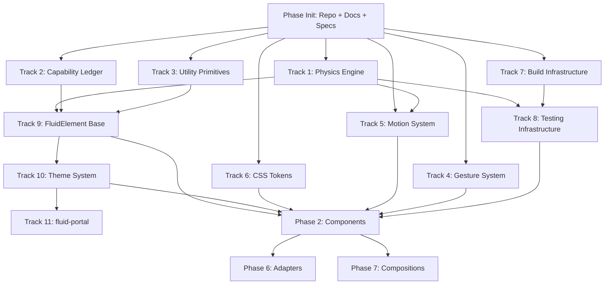

# `@neutro/fluid` — Implementation Roadmap
**Version:** 1.1
**Purpose:** Bite-sized, testable subtasks for AI-agent-powered implementation.

---

## Status

**Last updated:** Sessions 14–22 complete, except P1-02 (`fluid-theme`) which was reported done but never implemented — see Phase 1 below. Corrected 2026-06-17.

### ✅ Completed

**Phase Init — Initialization**
- ✅ INIT-01 — Repository and monorepo directory structure
- ✅ INIT-02 — Agent context files
- ✅ INIT-03 — Shared TypeScript and ESLint configs
- ✅ INIT-04 — Foundation documents committed to repo
- ✅ INIT-05 — Turborepo build pipeline
- ✅ INIT-06 — `packages/fluid/package.json` subpath exports map
- ✅ INIT-07 — Component spec files
- ✅ INIT-08 — Storybook scaffold

**Phase 0 — Core Primitives**

*Track 1 — Physics Engine*
- ✅ P0-T1-01 — Spring solver: underdamped regime
- ✅ P0-T1-02 — Spring solver: critically damped and overdamped regimes
- ✅ P0-T1-03 — Spring config validation
- ✅ P0-T1-04 — AnimationDriver singleton
- ✅ P0-T1-05 — Velocity registry and `startSpring()`
- ✅ P0-T1-06 — WillChangeManager (reference counter)
- ✅ P0-T1-07 — Reactive spring values
- ✅ P0-T1-08 — Named spring presets

*Track 2 — Capability Ledger*
- ✅ P0-T2-01 — Ledger sync phase + SSR defaults
- ✅ P0-T2-02 — Ledger async phase + tier upgrade
- ✅ P0-T2-03 — Accessibility media query detection + reactivity

*Track 3 — Utility Primitives*
- ✅ P0-T3-01 — ZIndexAllocator
- ✅ P0-T3-02 — ScrollLockManager
- ✅ P0-T3-03 — `generateFluidId`
- ✅ P0-T3-04 — Context protocol (WCCG)
- ✅ P0-T3-05 — FluidI18n translation map
- ✅ P0-T3-06 — TooltipManager singleton
- ✅ P0-T3-07 — ToastManager singleton

*Track 4 — Gesture System*
- ✅ P0-T4-01 — Pointer capture pattern
- ✅ P0-T4-02 — Press + hover gesture
- ✅ P0-T4-03 — Drag gesture + constraints
- ✅ P0-T4-04 — Swipe, flick, and inertia
- ✅ P0-T4-05 — Pinch and long-press

*Track 5 — Motion System*
- ✅ P0-T5-01 — Named motion primitives
- ✅ P0-T5-02 — Animation variants + orchestration
- ✅ P0-T5-03 — Scroll-linked values + FLIP layout animation
- ✅ P0-T5-04 — View Transitions integration

*Track 6 — CSS Token System*
- ✅ P0-T6-01 — Base token file (`default.css`)
- ✅ P0-T6-02 — Tier-aware color tokens (`@supports` enhancement)
- ✅ P0-T6-03 — Dark, high-contrast, anti-FOUC, print token files

*Track 7 — Build Infrastructure*
- ✅ P0-T7-01 — pnpm workspace + Turborepo
- ✅ P0-T7-02 — tsup per-package build config
- ✅ P0-T7-03 — Test runner configs
- ✅ P0-T7-04 — Storybook + Chromatic config

*Track 8 — Testing Infrastructure*
- ✅ P0-T8-01 — FluidSpringUtils (spring test helpers)
- ✅ P0-T8-02 — FluidTestUtils (component test helpers)
- ✅ P0-T8-03 — FluidAccessibilityUtils

**Phase 1 — Component Foundation**
- ✅ P1-01 — FluidElement base class
- ⬜ P1-02 — `fluid-theme` element — NOT DONE. No `components/theme/` exists; `core/element.ts` carries a typed placeholder (`export type FluidTheme = HTMLElement`) and `fluid-portal` ships a private `snapshotTokens()` workaround pending this. Blocks P3-01, P3-02. (Status corrected 2026-06-17.)
- ✅ P1-03 — `fluid-portal` element
- ✅ P1-04 — `core/ripple.ts` (FluidRipple canvas primitive)

**Phase 2 — First Components**
- ✅ P2-01 — `fluid-button`
- ✅ P2-02 — `fluid-icon-button`
- ✅ P2-03 — `fluid-card`
- ✅ P2-04 — `fluid-stack` + `fluid-spacer`
- ✅ P2-05 — `fluid-visually-hidden`
- ✅ P2-06 — `fluid-empty-state`
- ✅ P2-07 — `fluid-skeleton` + `fluid-spinner` + `fluid-progress`
- ✅ P2-08 — `fluid-fieldset`

### ⬜ Not Started

- ⬜ **Phase 3** — Navigation Components
- ⬜ **Phase 4** — Inputs
- ⬜ **Phase 5** — Overlays + Sheets
- ⬜ **Phase 6** — Data Display + System
- ⬜ **Phase 7** — Framework Adapters
- ⬜ **Phase 8** — Compositions

---

## Agent Agnosticism

This roadmap describes **what to build and what done looks like**. It does not describe how any specific agent tool executes work. The *how* is in each agent's context file:

- **Claude Code** → `CLAUDE.md`
- **Cursor** → `.cursor/rules/fluid.mdc`
- **GitHub Copilot** → `.github/copilot-instructions.md`
- **Any other agent** → `AGENTS.md` (universal context, read this first)

Every agent session — regardless of tool — starts with the **Session Start Checklist** before touching any code (see below). The subtask spec tells you what to build. Your agent context file tells you how to use your tool to build it.

---

## Session Start Checklist

**Run this at the beginning of every implementation session, before writing any code:**

1. Read `AGENTS.md` — critical rules, common mistakes, architecture lookup
2. Find your subtask ID (e.g., `P0-T1-01`)
3. Read the subtask's **Spec to read** field — open the referenced section of `docs/fluid-foundation-v5.md`
4. Confirm all **Depends on** subtasks are marked done (green tests committed)
5. Run the test baseline: `pnpm test:unit` (fast, always) — confirm no pre-existing failures
6. Read the **Contract** this subtask exposes — understand what downstream subtasks expect from you
7. Write the failing tests first, then implement

**A subtask is not done until:**
- All acceptance criteria tests are green
- The deliverable files are committed
- The contract is unchanged from what was specified (or downstream subtasks are updated)

---

## How to Use This Document

Each subtask:
- **ID** — unique identifier for dependency tracking
- **Spec to read** — section of `docs/fluid-foundation-v5.md` or component spec file to read before starting
- **Depends on** — subtask IDs that must be complete (green) before this starts
- **Deliverable** — exact file(s) produced
- **Contract** — what this subtask exposes for downstream subtasks to consume
- **Acceptance criteria** — exact tests that must pass (green = done)
- **Size** — S (< 1hr), M (1–3hr), L (3–6hr), XL (6hr+)

**No partial credit. Not done until all acceptance criteria pass.**

---

## Dependency Graph



**The Initialization Phase is strictly sequential and must complete before any parallel track starts.**
**Tracks T1–T7 can all start in parallel once Init is done.**

---

## Phase Init: Initialization (Sequential — Do This First)

*These tasks must be done in order. Nothing else can start until Init is complete. Most are one session each.*

---

**INIT-01: Repository and monorepo directory structure**
- **Spec to read:** `docs/fluid-monorepo.md` (full monorepo architecture decision)
- **Depends on:** nothing (this is the very first task)
- **Deliverable:**
  ```
  fluid/
  ├── packages/fluid/src/         (empty, structure only)
  ├── packages/fluid-data-grid/   (empty stub)
  ├── apps/studio/                (empty stub)
  ├── apps/docs/                  (empty stub)
  ├── apps/storybook/             (empty stub)
  ├── tooling/tsconfig/
  ├── tooling/eslint/
  ├── tooling/vitest/
  ├── .gitignore
  └── (all config files below)
  ```
- **Acceptance criteria:**
  - `git init` done, `.gitignore` covers `node_modules`, `dist`, `.turbo`, `.env`
  - `pnpm-workspace.yaml` lists all packages and apps
  - `packages/fluid/package.json` exists with correct name `@neutro/fluid`, version `0.1.0`
  - Running `pnpm install` from root succeeds (no packages yet, just structure)
- **Size:** S

---

**INIT-02: Agent context files**
- **Spec to read:** `docs/fluid-foundation-v5.md` §XX (Agent Context Files)
- **Depends on:** INIT-01
- **Deliverable:**
  ```
  AGENTS.md                          (root — universal, tool-agnostic)
  CLAUDE.md                          (root — Claude Code supplement)
  .cursor/rules/fluid.mdc            (Cursor supplement)
  .github/copilot-instructions.md    (GitHub Copilot supplement)
  packages/fluid/AGENTS.md           (package-level agent context)
  ```
- **Contract:** Every subsequent session reads `AGENTS.md` before starting. These files are the shared brain for all agent sessions.
- **Acceptance criteria:**
  - `AGENTS.md` contains: 8 design axioms, critical rules, standard test matrix, common mistakes, architecture lookup table, session start checklist
  - `CLAUDE.md` references `AGENTS.md` and adds tool-specific commands — no `/mnt/` paths
  - `.cursor/rules/fluid.mdc` contains the same critical rules in Cursor MDC format
  - `.github/copilot-instructions.md` contains the same critical rules in Copilot format
  - `packages/fluid/AGENTS.md` inherits root and adds package-specific context (src layout, test commands for this package)
- **Size:** M

---

**INIT-03: Shared TypeScript and ESLint configs**
- **Spec to read:** nothing (standard tooling)
- **Depends on:** INIT-01
- **Deliverable:**
  ```
  tooling/tsconfig/base.json         # strict, ESM, lib: ES2022
  tooling/tsconfig/component.json    # extends base, adds DOM lib
  tooling/tsconfig/test.json         # extends base, adds test globals
  tooling/eslint/index.js            # shared ESLint config
  packages/fluid/tsconfig.json       # extends tooling/tsconfig/component.json
  ```
- **Acceptance criteria:**
  - `tsc --noEmit` passes on an empty `packages/fluid/src/index.ts`
  - ESLint config includes `@neutro/fluid/eslint-plugin` rules (no-shadow-piercing, icon-button-aria-label) — stubs for now
  - TypeScript strict mode on (noImplicitAny, strictNullChecks, etc.)
- **Size:** S

---

**INIT-04: Foundation documents committed to repo**
- **Spec to read:** N/A
- **Depends on:** INIT-01
- **Deliverable:**
  ```
  docs/fluid-foundation-v5.md
  docs/fluid-testing-strategy.md
  docs/fluid-monorepo.md
  docs/fluid-adversarial-review-1.md
  docs/fluid-adversarial-review-2.md
  docs/fluid-adversarial-review-3.md
  docs/fluid-roadmap.md              (this file)
  ```
- **Contract:** All subsequent sessions reference these files by path. The foundation doc is the authoritative spec.
- **Acceptance criteria:**
  - All files present in `docs/`
  - `docs/README.md` created: index of all documents with one-line descriptions and direct links
  - No broken internal references (grep for `§` section references, verify sections exist)
- **Size:** S

---

**INIT-05: Turborepo build pipeline**
- **Spec to read:** `docs/fluid-monorepo.md` (tooling stack section)
- **Depends on:** INIT-01, INIT-03
- **Deliverable:** `turbo.json`, root `package.json` scripts
- **Acceptance criteria:**
  - `turbo.json` defines pipelines: `build`, `test`, `test:unit`, `test:component`, `lint`, `typecheck`
  - Dependencies correct: `build` depends on upstream `build`; `test` depends on `build`
  - `pnpm -r build` runs (produces nothing yet but does not error)
  - Turborepo caching: second identical `pnpm -r build` is 100% cached (no work done)
- **Size:** S

---

**INIT-06: `packages/fluid/package.json` subpath exports map**
- **Spec to read:** `docs/fluid-foundation-v5.md` §XVII (subpath exports map)
- **Depends on:** INIT-01, INIT-03
- **Deliverable:** `packages/fluid/package.json` complete with all fields
- **Acceptance criteria:**
  - All subpath exports present: `./core`, `./icons`, `./theme/*`, `./adapters/react`, `./adapters/vue`, `./adapters/svelte`, `./adapters/angular`, `./testing`, `./eslint-plugin`, and one per component (stubs for now)
  - Optional peer deps declared: React, Vue, Svelte, Angular all `optional: true`
  - `sideEffects` array covers all component `.ts` files and token `.css` files
  - `size-limit` config present: `@neutro/fluid/core` limit `10KB gzip`
  - `imports '@neutro/fluid/core'` resolves (even to an empty file) — no resolution error
- **Size:** M

---

**INIT-07: Component spec files (one session per component group)**
- **Spec to read:** `docs/fluid-foundation-v5.md` §XIX (Component Specification Template)
- **Depends on:** INIT-04
- **Deliverable:** One spec file per component, organized as:
  ```
  docs/components/button/button.spec.md
  docs/components/card/card.spec.md
  docs/components/icon-button/icon-button.spec.md
  ... (all Phase 2 components)
  ```
- **Contract:** These files are read at the start of every component implementation session. They are the authoritative per-component requirement. If the foundation doc and a spec file conflict, the spec file wins (it is more specific).
- **Parallelizable:** Yes — split by component group. Each group is one session:
  - `INIT-07a`: button, icon-button, fab (action components)
  - `INIT-07b`: card, section, divider (surface components)
  - `INIT-07c`: stack, spacer, visually-hidden, empty-state (layout/utility)
  - `INIT-07d`: skeleton, spinner, progress (feedback)
  - `INIT-07e`: fieldset (form grouping)
- **Acceptance criteria per spec file:**
  - All template sections filled in (Classification, Attributes, Properties, Slots, Events, ARIA, State Machine, Tier Behaviour, Accessibility)
  - No "TBD" entries — every field has a concrete value or "N/A"
  - ARIA table entry from foundation doc §X is reproduced in the spec
  - At least one acceptance criterion per state (default, hover, focus, active, disabled, loading, error where applicable)
- **Size:** M per group

---

**INIT-08: Storybook scaffold**
- **Spec to read:** `docs/fluid-testing-strategy.md` §Tier 4 (Visual Regression)
- **Depends on:** INIT-05
- **Deliverable:** `apps/storybook/.storybook/` config + one placeholder story
- **Acceptance criteria:**
  - `pnpm --filter storybook dev` starts Storybook without errors
  - Placeholder story renders (no real components yet — just a "Coming soon" panel)
  - Tier parameter (`globals.fluidTier`) wired up: changes `window.__FLUID_FORCE_TIER__`
  - Light/dark mode parameter wired up: changes `prefers-color-scheme` emulation
  - `pnpm test:visual` runs against placeholder without Chromatic errors (no baselines yet)
- **Size:** M

---

---

## Phase 0: Core Primitives

### Track 1 — Physics Engine
*Pure TypeScript. No browser APIs. No DOM. Fully unit-testable with Vitest in Node.js.*

---

**P0-T1-01: Spring solver — underdamped regime**
- **Depends on:** nothing
- **Deliverable:** `packages/fluid/src/core/spring.ts` (partial — underdamped case only)
- **Contract:**
  ```typescript
  export function stepSpring(config: SpringConfig, state: SpringState, target: number, dt: number): SpringState
  export interface SpringConfig { mass: number; stiffness: number; damping: number }
  export interface SpringState { value: number; velocity: number }
  ```
- **Acceptance criteria:**
  - `snappy` preset settles to target within 300ms at 60fps
  - Overshoots slightly (ζ ≈ 0.99 is underdamped — verify max > 1.0 for target=1)
  - Frame-rate independent: `run(60fps, 500ms)` ≈ `run(120fps, 500ms)` within 1%
  - No NaN or Infinity produced for valid inputs
- **Size:** M

---

**P0-T1-02: Spring solver — critically damped and overdamped regimes**
- **Depends on:** P0-T1-01
- **Deliverable:** `packages/fluid/src/core/spring.ts` (complete — all three regimes)
- **Contract:** Same as P0-T1-01 — `stepSpring` handles all ζ values
- **Acceptance criteria:**
  - `ζ = 1.0` (critical): no overshoot, fastest settle
  - `ζ > 1.0` (over): no overshoot, slower settle
  - `ζ < 1.0` (under): overshoots, then settles
  - All three regimes produce identical `stepSpring` signature — caller has no branching
- **Size:** M

---

**P0-T1-03: Spring config validation**
- **Depends on:** P0-T1-01
- **Deliverable:** `packages/fluid/src/core/spring.ts` (adds validation)
- **Contract:**
  ```typescript
  export function validateSpringConfig(cfg: SpringConfig): void  // throws FluidError in dev, clamps in prod
  export class FluidError extends Error {}
  ```
- **Acceptance criteria:**
  - `mass <= 0` → throws `FluidError` in dev, clamps to `0.01` in prod
  - `stiffness <= 0` → same
  - `damping < 0` → same
  - Valid config → no throw, no side effects
- **Size:** S

---

**P0-T1-04: AnimationDriver singleton**
- **Depends on:** P0-T1-01, P0-T1-02
- **Deliverable:** `packages/fluid/src/core/driver.ts`
- **Contract:**
  ```typescript
  export interface SpringTask { advance(dt: number): boolean }  // returns true when settled
  export const driver: AnimationDriver  // Symbol.for('neutro.fluid.driver') singleton
  // driver.register(id: symbol, task: SpringTask): void
  // driver.deregister(id: symbol): void
  ```
- **Acceptance criteria:**
  - Single rAF loop for N registered springs (not N loops)
  - `dt` derived from real timestamps, capped at 64ms
  - Pauses on `document.hidden`, resumes with `dt = 16ms` (no giant step)
  - Two imports of the module → same singleton instance (Symbol.for test)
  - Deregisters automatically when task returns `true` (settled)
- **Size:** M

---

**P0-T1-05: Velocity registry and `startSpring()`**
- **Depends on:** P0-T1-01, P0-T1-02, P0-T1-03, P0-T1-04
- **Deliverable:** `packages/fluid/src/core/driver.ts` (extends with velocity registry)
- **Contract:**
  ```typescript
  export function startSpring(
    el: Element, property: string, target: number, config: SpringConfig,
    options?: { velocityScale?: number; maxVelocity?: number }
  ): Promise<void>
  ```
- **Acceptance criteria:**
  - Interrupted animation: new spring starts with interrupted spring's velocity (not 0)
  - `velocityScale` correctly normalizes gesture velocity to property units
  - Velocity clamped to `maxVelocity` (default 2000) before use
  - Settling threshold is `range * 0.001`, not absolute `0.001`
  - Returned Promise resolves when spring settles
  - `WillChangeManager.acquire()` called on start, `release()` called on settle
- **Size:** L

---

**P0-T1-06: WillChangeManager (reference counter)**
- **Depends on:** nothing (pure logic, no DOM needed for logic test)
- **Deliverable:** `packages/fluid/src/core/will-change.ts`
- **Contract:**
  ```typescript
  export const WillChangeManager: { acquire(el: Element): void; release(el: Element): void }
  ```
- **Acceptance criteria:**
  - Two `acquire` calls → `will-change` remains set; one `release` → still set; second `release` → removed
  - `release` below 0 refs: clamps to 0, does not throw
  - No WeakMap memory leak: element GC removes entry (verify with WeakRef in test)
- **Size:** S

---

**P0-T1-07: Reactive spring values**
- **Depends on:** P0-T1-05
- **Deliverable:** `packages/fluid/src/core/reactive.ts`
- **Contract:**
  ```typescript
  export function spring(initial: number, preset: SpringPreset | SpringConfig): ReactiveSpring
  interface ReactiveSpring {
    to(target: number): ReactiveSpring
    subscribe(fn: (v: number) => void): () => void  // returns unsubscribe
    settled(): Promise<void>
    dispose(): void
  }
  ```
- **Acceptance criteria:**
  - `subscribe` called on each frame during animation
  - `settled()` resolves when spring reaches target
  - Multiple subscribers all receive same value
  - `dispose()` cancels animation and all subscriptions
  - `to()` with new target mid-animation preserves velocity
- **Size:** M

---

**P0-T1-08: Named spring presets**
- **Depends on:** P0-T1-01
- **Deliverable:** `packages/fluid/src/core/spring.ts` (adds SPRING_PRESETS export)
- **Contract:**
  ```typescript
  export const SPRING_PRESETS: Record<SpringPreset, SpringConfig>
  export type SpringPreset = 'snappy' | 'bouncy' | 'gentle' | 'smooth' | 'precise'
  ```
- **Acceptance criteria (golden values — must be exact):**
  - `snappy:  { mass: 0.5, stiffness: 400, damping: 28 }`
  - `bouncy:  { mass: 1.0, stiffness: 300, damping: 20 }`
  - `gentle:  { mass: 1.0, stiffness: 120, damping: 20 }`
  - `smooth:  { mass: 1.0, stiffness: 200, damping: 26 }`
  - `precise: { mass: 0.8, stiffness: 500, damping: 32 }`
  - TypeScript type is a string literal union (no magic strings in component code)
- **Size:** S

---

### Track 2 — Capability Ledger
*Browser detection + SSR-safe. No DOM required for logic tests.*

---

**P0-T2-01: Ledger sync phase + SSR defaults**
- **Depends on:** nothing
- **Deliverable:** `packages/fluid/src/core/ledger.ts`
- **Contract:**
  ```typescript
  export interface FluidCapabilityLedger { tier: FluidTier; backdropFilter: boolean; /* ...all fields */ }
  export type FluidTier = 'matte' | 'frosted' | 'crystalline' | 'optical'
  export const ledger: FluidCapabilityLedger  // sync, available immediately on import
  ```
- **Acceptance criteria:**
  - In Node.js (SSR): `ledger.tier === 'matte'`, all capabilities `false`, no `window` access
  - In browser without backdrop-filter: `tier === 'matte'`
  - `prefersReducedMotion`, `prefersContrast`, `prefersReducedTransparency`, `forcedColors` correctly detected
  - `deviceMemoryLow`, `cpuCoresLow`, `saveData` soft hints populated
- **Size:** M

---

**P0-T2-02: Ledger async phase + tier upgrade**
- **Depends on:** P0-T2-01
- **Deliverable:** `packages/fluid/src/core/ledger.ts` (adds async phase)
- **Contract:** `ledger` is mutated after async phase; `fluidledger:upgrade` event dispatched on `document`
- **Acceptance criteria:**
  - Houdini worklet attempt: success → tier upgrades to `optical`; failure → stays at crystalline
  - Worklet failure dispatches dev warning containing "CSP"
  - `fluidledger:upgrade` event fires with `{ previousTier, newTier }` in detail
  - Tier forcing: `FluidLedger.forceTier('frosted')` works; strips to no-op in production build
- **Size:** M

---

**P0-T2-03: Accessibility media query detection + reactivity**
- **Depends on:** P0-T2-01
- **Deliverable:** `packages/fluid/src/core/ledger.ts` (adds media query listeners)
- **Contract:** Ledger updates `prefersReducedMotion`, `prefersContrast` etc. at runtime when OS settings change; dispatches `fluidledger:accessibility-change`
- **Acceptance criteria:**
  - Mock `matchMedia` in test → verify ledger fields update when media query changes
  - Listener cleanup: `removeEventListener` called when module is unloaded (test with mock)
  - Does not re-detect tier capabilities on accessibility change (tier is immutable after init)
- **Size:** S

---

### Track 3 — Utility Primitives
*Pure logic. All testable in Vitest (Node.js).*

---

**P0-T3-01: ZIndexAllocator**
- **Depends on:** nothing
- **Deliverable:** `packages/fluid/src/core/z-index.ts`
- **Contract:**
  ```typescript
  export const zIndex: ZIndexAllocator  // Symbol.for singleton
  // zIndex.allocate(layer: FluidLayer): number
  // zIndex.release(layer: FluidLayer): void
  ```
- **Acceptance criteria:**
  - Later-allocated overlay always has higher z-index than earlier-allocated
  - `release` then `allocate` for same layer: new allocation is ≥ previous
  - Two module instances → same singleton (Symbol.for test)
  - Layer bounds respected: Surface allocations never exceed Raised base z-index
- **Size:** S

---

**P0-T3-02: ScrollLockManager**
- **Depends on:** nothing
- **Deliverable:** `packages/fluid/src/core/scroll-lock.ts`
- **Contract:**
  ```typescript
  export const ScrollLockManager: { lock(): void; unlock(): void; isLocked: boolean }
  ```
- **Acceptance criteria:**
  - `lock()` → `document.body.overflow === 'hidden'` + padding-right set to scrollbar width
  - `lock()` called twice → `unlock()` once does not unlock (ref-counted)
  - `unlock()` → padding-right restored, overflow restored
  - iOS: `document.body.position === 'fixed'` on lock, restored with correct scrollTop on unlock
  - No layout shift: padding-right compensates for scrollbar width precisely
- **Size:** M

---

**P0-T3-03: `generateFluidId`**
- **Depends on:** nothing
- **Deliverable:** `packages/fluid/src/core/id.ts`
- **Contract:**
  ```typescript
  export function generateFluidId(prefix: string, hostElement: Element): string
  ```
- **Acceptance criteria:**
  - Same element + same prefix → same ID on every call (deterministic)
  - Different elements → different IDs (no collision)
  - If `hostElement.id` is set → uses it as base
  - SSR simulation: `getElementPath()` produces same string for same DOM position
  - Output matches pattern `^fluid-[a-z]+-[a-z0-9]+$`
- **Size:** S

---

**P0-T3-04: Context protocol (WCCG)**
- **Depends on:** nothing
- **Deliverable:** `packages/fluid/src/core/context.ts`
- **Contract:**
  ```typescript
  export function provideContext<T>(el: HTMLElement, key: symbol, value: T): void
  export function requestContext<T>(el: HTMLElement, key: symbol, callback: (value: T) => void): void
  ```
- **Acceptance criteria:**
  - Child `requestContext` → parent's `provideContext` callback called with value
  - Event does not cross shadow boundaries (`composed: false`)
  - `requestContext` from element with no matching provider → callback not called, no error
  - Multiple providers at different depths → nearest ancestor wins
- **Size:** S

---

**P0-T3-05: FluidI18n translation map**
- **Depends on:** nothing
- **Deliverable:** `packages/fluid/src/core/i18n.ts`
- **Contract:**
  ```typescript
  export const FluidI18n: {
    use(locale: string, translations: Record<string, string>): void
    t(key: string, fallback: string): string
  }
  ```
- **Acceptance criteria:**
  - `t('drop-label', 'Drop files')` → returns English fallback when no locale set
  - After `use('es', { 'drop-label': 'Arrastra archivos' })` → returns Spanish
  - Unknown key → returns fallback (never throws)
  - Multiple `use()` calls → translations merge (later calls override earlier for same key)
- **Size:** S

---

**P0-T3-06: TooltipManager singleton**
- **Depends on:** nothing
- **Deliverable:** `packages/fluid/src/core/tooltip-manager.ts`
- **Contract:**
  ```typescript
  export const tooltipManager: TooltipManager  // Symbol.for singleton
  // tooltipManager.show(tooltip: FluidTooltipElement): void
  // tooltipManager.hide(tooltip: FluidTooltipElement): void
  ```
- **Acceptance criteria:**
  - `maxVisible: 1` (default): showing a second tooltip hides the first
  - Hover intent delay: `show()` called immediately but tooltip not made visible until `hoverDelay` ms
  - Two module instances → same singleton (Symbol.for)
- **Size:** S

---

**P0-T3-07: ToastManager singleton**
- **Depends on:** nothing
- **Deliverable:** `packages/fluid/src/core/toast-manager.ts`
- **Contract:**
  ```typescript
  export const toastManager: ToastManager  // Symbol.for singleton
  export function toast(message: string, options?: ToastOptions): ToastHandle
  ```
- **Acceptance criteria:**
  - Only one toast in `aria-live` region at a time
  - Second toast queued; appears `announcementGap` ms after first
  - Rapid sequence (3 toasts in 50ms) → 3 queued, announced sequentially
  - `ToastHandle.dismiss()` removes toast immediately; `update(msg)` replaces content
  - Two module instances → same singleton (Symbol.for)
- **Size:** M

---

### Track 4 — Gesture System
*PointerEvents API. Requires browser environment — tested with @web/test-runner.*

---

**P0-T4-01: Pointer capture pattern**
- **Depends on:** nothing
- **Deliverable:** `packages/fluid/src/core/gesture.ts` (capture utilities)
- **Contract:**
  ```typescript
  export function capturePointer(el: Element, pointerId: number): void
  export function releasePointer(el: Element, pointerId: number): void
  ```
- **Acceptance criteria:**
  - `element.setPointerCapture(id)` called — verified via spy
  - `element.releasePointerCapture(id)` called on pointerup and pointercancel
  - Pointer events continue firing after pointer leaves element bounds
- **Size:** S

---

**P0-T4-02: Press + hover gesture**
- **Depends on:** P0-T4-01
- **Deliverable:** `packages/fluid/src/core/gesture.ts`
- **Contract:**
  ```typescript
  FluidGesture.press(el, { onPress, onRelease })
  FluidGesture.hover(el, { onEnter, onLeave, delay?: number })
  ```
- **Acceptance criteria:**
  - `onPress` fires on `pointerdown + pointerup` on same element
  - `onPress` does NOT fire if pointer moved > 8px (drag intent)
  - `onRelease` always fires on `pointerup` (even if moved)
  - Multi-touch: only first `pointerdown` triggers press; additional pointers ignored
  - Hover: `onLeave` debounced by `delay` ms (default 50)
- **Size:** M

---

**P0-T4-03: Drag gesture + constraints**
- **Depends on:** P0-T4-01, P0-T4-02
- **Deliverable:** `packages/fluid/src/core/gesture.ts`
- **Contract:**
  ```typescript
  FluidGesture.drag(el, {
    constraints?: DragConstraints,
    onDrag: ({ x, y, velocity }) => void,
    onRelease: ({ x, y, velocity }) => void,
    longPressThreshold?: number  // px to cancel long-press (default: 8)
  })
  ```
- **Acceptance criteria:**
  - `setPointerCapture` called on `pointerdown` — non-negotiable
  - `axis: 'x'` → y movement ignored
  - `elastic: true` + `bounds` → exponential resistance past bounds
  - Velocity is px/ms, correctly derived from timestamp delta
  - `grid` snap: rounds final position to nearest grid step on release
  - `transform` constraint: custom function applied to (x, y) — allows any shape constraint
- **Size:** L

---

**P0-T4-04: Swipe, flick, and inertia**
- **Depends on:** P0-T4-01
- **Deliverable:** `packages/fluid/src/core/gesture.ts`
- **Contract:**
  ```typescript
  FluidGesture.swipe(el, { onSwipe: ({ direction, velocity }) => void, threshold?: number })
  ```
- **Acceptance criteria:**
  - Velocity above threshold (default 0.5 px/ms) → `onSwipe` fires with direction
  - Velocity below threshold → treated as drag, not swipe
  - Flick velocity (> 1.5 px/ms) → `flick` flag true in swipe event
  - Direction correctly computed from net displacement vector
- **Size:** M

---

**P0-T4-05: Pinch and long-press**
- **Depends on:** P0-T4-01
- **Deliverable:** `packages/fluid/src/core/gesture.ts`
- **Contract:**
  ```typescript
  FluidGesture.pinch(el, { onPinch: ({ scale, midpoint }) => void })
  FluidGesture.longPress(el, { onProgress: (p: number) => void, onActivate: () => void, duration?: number })
  ```
- **Acceptance criteria:**
  - Pinch: scale = current_distance / initial_distance
  - Pinch: midpoint is average of two pointer positions
  - Long-press: progress 0→1 over `duration` ms (default 500)
  - Long-press cancelled if pointer moves > `longPressThreshold` px
  - Long-press on same element as drag: see disambiguation rule (8px threshold)
- **Size:** M

---

### Track 5 — Motion System
*Consumes Track 1 (physics). Requires browser (rAF, DOM). Tested with @web/test-runner.*

---

**P0-T5-01: Named motion primitives**
- **Depends on:** P0-T1-05 (startSpring)
- **Deliverable:** `packages/fluid/src/core/motion.ts`
- **Contract:**
  ```typescript
  export const motion: {
    emerge(): MotionDef
    recede(): MotionDef
    rise(): MotionDef; sink(): MotionDef
    expand(): MotionDef; collapse(): MotionDef
    float(): MotionDef; settle(): MotionDef
    depress(): MotionDef; release(): MotionDef
    pulse(): MotionDef; shake(): MotionDef
    grow(): MotionDef; shrink(): MotionDef
    animate(el: Element, def: MotionDef): Promise<void>
  }
  ```
- **Acceptance criteria:**
  - `emerge`: scale 0.92→1.0 + opacity 0→1, `smooth` spring
  - `depress`: scale 1→0.96, `snappy` spring
  - `release`: scale 0.96→1, `bouncy` spring
  - Each motion uses the correct spring preset from the spec (tested with golden values)
  - `animate()` returns a Promise that resolves when all spring animations settle
  - `prefers-reduced-motion: reduce` → `emerge` becomes opacity-only fade (no scale)
- **Size:** L

---

**P0-T5-02: Animation variants + orchestration**
- **Depends on:** P0-T5-01
- **Deliverable:** `packages/fluid/src/core/motion.ts`
- **Contract:**
  ```typescript
  motion.variants(el, states: Record<string, MotionState>, opts: { spring: SpringPreset })
  motion.set(el, stateName: string): Promise<void>
  motion.stagger(els: Element[], stateName: string, opts: { delay: number }): Promise<void>
  motion.sequence(steps: Array<[Element, string, string]>): Promise<void>
  ```
- **Acceptance criteria:**
  - `set()` during an in-progress animation → velocity preserved (not reset to 0)
  - `stagger()`: elements begin at `index * delay` ms offsets, each using correct spring
  - `sequence()`: step N does not begin until step N-1's Promise resolves
  - `set()` before element is mounted → state queued, applied on `fluid:mounted`
- **Size:** M

---

**P0-T5-03: Scroll-linked values + FLIP layout animation**
- **Depends on:** P0-T5-01
- **Deliverable:** `packages/fluid/src/core/motion.ts`
- **Contract:**
  ```typescript
  motion.scrollProgress(container: Element): { progress: ReactiveValue; velocity: ReactiveValue }
  motion.bind(el: Element, property: string, source: ReactiveValue, opts: { from, to, clamp? })
  motion.flip(el: Element, mutate: () => void): Promise<void>
  ```
- **Acceptance criteria:**
  - `scrollProgress.progress`: 0.0 at top of container, 1.0 at bottom
  - `bind`: property updates every frame during scroll
  - `clamp: true`: value never exceeds `from`/`to` bounds
  - `flip`: reads position before + after `mutate()`, springs from inverted transform to identity
  - FLIP reads happen outside rAF (not inside animation loop)
- **Size:** M

---

**P0-T5-04: View Transitions integration**
- **Depends on:** P0-T5-01
- **Deliverable:** `packages/fluid/src/core/motion.ts`
- **Contract:**
  ```typescript
  export function startFluidTransition(updateFn: () => void): Promise<void>
  ```
- **Acceptance criteria:**
  - Concurrent transition call → waits for in-flight transition, then applies update (no error)
  - `document.startViewTransition` not available → `updateFn()` called directly
  - Transition lock prevents parallel transitions from corrupting each other
- **Size:** S

---

### Track 6 — CSS Token System
*Pure CSS. No JavaScript dependencies. Verified by loading in browser and checking computed values.*

---

**P0-T6-01: Base token file (`default.css`)**
- **Depends on:** nothing
- **Deliverable:** `packages/fluid/src/tokens/themes/default.css`
- **Contract:** All `--fluid-*` tokens defined at `:root` (see §VI of foundation doc)
- **Acceptance criteria (golden values — all must be exact):**
  - `--fluid-blur-thin: 8px`, `--fluid-blur-regular: 20px`, `--fluid-blur-thick: 40px`
  - `--fluid-vibrancy: 1.8`, `--fluid-ior: 0.012`, `--fluid-fresnel-strength: 0.18`
  - `--fluid-elasticity-max: 64px`, `--fluid-scroll-friction: 0.95`
  - All five spring presets defined as triplets (mass/stiff/damp)
  - HSL color scale (50–900) for each semantic hue defined
  - All typography tokens present
- **Size:** M

---

**P0-T6-02: Tier-aware color tokens (`@supports` enhancement)**
- **Depends on:** P0-T6-01
- **Deliverable:** `packages/fluid/src/tokens/themes/default.css` (enhancement added)
- **Contract:** `@supports (color: oklch(from red 1 1 1))` block adds oklch-based scale
- **Acceptance criteria:**
  - In browsers without CSS relative colors: HSL scale is active
  - In browsers with CSS relative colors: oklch scale overrides (verified in real browser test)
  - oklch scale uses proportional chroma (`calc(c * 0.25)` etc.) — not hardcoded chroma
- **Size:** S

---

**P0-T6-03: Dark, high-contrast, anti-FOUC, print token files**
- **Depends on:** P0-T6-01
- **Deliverable:** `dark.css`, `high-contrast.css`, `anti-fouc.css`, `print.css`
- **Acceptance criteria:**
  - `dark.css`: tint tokens use dark values; color lightness steps inverted
  - `high-contrast.css`: tint alpha → 0.95 (near-opaque), borders on all interactive elements
  - `anti-fouc.css`: all component tag names + `:not(:defined)` → `visibility: hidden`
  - `print.css`: `@media print` resets on all glass surfaces
- **Size:** M

---

### Track 7 — Build Infrastructure
*Repo setup. No functional code. Verified by actually running builds and tests.*

---

**P0-T7-01: pnpm workspace + Turborepo**
- **Depends on:** nothing
- **Deliverable:** `pnpm-workspace.yaml`, `turbo.json`, root `package.json`
- **Acceptance criteria:**
  - `pnpm install` from root succeeds
  - `pnpm -r build` runs all package builds in correct dependency order
  - `pnpm -r test` runs all tests
  - Turborepo caching: second `pnpm -r build` with no changes is 100% cached
- **Size:** M

---

**P0-T7-02: tsup per-package build config**
- **Depends on:** P0-T7-01
- **Deliverable:** `packages/fluid/tsup.config.ts`, per-package build outputs
- **Acceptance criteria:**
  - ESM output: `dist/esm/`
  - CJS output: `dist/cjs/`
  - TypeScript declarations: `dist/types/`
  - Each subpath export resolves correctly: `import '@neutro/fluid/button'` works
  - Houdini worklets copied to `dist/worklets/`
  - `size-limit` config present and passing with initial empty package
- **Size:** M

---

**P0-T7-03: Test runner configs**
- **Depends on:** P0-T7-01
- **Deliverable:** `vitest.config.ts`, `web-test-runner.config.mjs`, `playwright.config.ts`
- **Acceptance criteria:**
  - `pnpm test:unit` runs Vitest in Node.js, finds all `*.test.ts` files in `core/`
  - `pnpm test:component` runs @web/test-runner with Playwright Chromium, finds `*.spec.ts` in `components/`
  - `pnpm test:integration` runs Playwright against a test server
  - Tier forcing via `window.__FLUID_FORCE_TIER__` works in @web/test-runner context
- **Size:** M

---

**P0-T7-04: Storybook + Chromatic config**
- **Depends on:** P0-T7-01
- **Deliverable:** `apps/storybook/.storybook/`, Chromatic integration
- **Acceptance criteria:**
  - `pnpm --filter storybook dev` starts Storybook
  - A placeholder story for `fluid-button` (not yet implemented) renders a placeholder
  - `pnpm test:visual` runs Chromatic (requires `CHROMATIC_TOKEN`)
  - Tier param (`?tier=frosted`) changes the story rendering tier
- **Size:** M

---

### Track 8 — Testing Infrastructure
*Requires Track 1 (spring) and Track 7 (build config).*

---

**P0-T8-01: FluidSpringUtils (spring test helpers)**
- **Depends on:** P0-T1-01, P0-T1-08, P0-T7-03
- **Deliverable:** `packages/fluid/src/testing/spring.ts`
- **Contract:**
  ```typescript
  FluidSpringUtils.simulate(preset, { from, to, durationMs }): { finalValue, didOvershoot, settleTimeMs }
  ```
- **Acceptance criteria:**
  - `simulate('snappy', { from: 0, to: 1, durationMs: 300 })` → `finalValue ≈ 1.0`, `didOvershoot: true`
  - `simulate('smooth', { from: 0, to: 1, durationMs: 500 })` → `finalValue ≈ 1.0`, `settleTimeMs < 400`
  - Property-based test with fast-check: for any valid config, `finalValue` converges, no NaN
- **Size:** M

---

**P0-T8-02: FluidTestUtils (component test helpers)**
- **Depends on:** P0-T7-03
- **Deliverable:** `packages/fluid/src/testing/utils.ts`
- **Contract:**
  ```typescript
  FluidTestUtils.mount(html: string): Promise<HTMLElement>
  FluidTestUtils.waitForSpringSettle(el: Element): Promise<void>
  FluidTestUtils.mockTier(tier: FluidTier): void
  FluidTestUtils.restoreTier(): void
  ```
- **Acceptance criteria:**
  - `mount('<fluid-button>Save</fluid-button>')` → returns element after `fluid:mounted` fires
  - `waitForSpringSettle` → resolves after all active springs on element are settled
  - `mockTier('frosted')` → `ledger.tier === 'frosted'` for all subsequently mounted components
  - `restoreTier()` → restores original tier
- **Size:** M

---

**P0-T8-03: FluidAccessibilityUtils**
- **Depends on:** P0-T7-03
- **Deliverable:** `packages/fluid/src/testing/accessibility.ts`
- **Contract:**
  ```typescript
  FluidAccessibilityUtils.assertAccessible(el: Element): Promise<void>
  FluidAccessibilityUtils.assertAccessibleInState(el: Element, state: string, setup: () => void): Promise<void>
  ```
- **Acceptance criteria:**
  - `assertAccessible` → runs axe-core, throws with violation details if any found
  - `assertAccessibleInState` → applies `setup()`, runs axe, restores state
  - Works in `@web/test-runner` context (real browser, real axe-core)
- **Size:** S

---

## Phase 1: Component Foundation
*Unlocks after: T1 (physics), T2 (ledger), T3 (utilities)*

---

**P1-01: FluidElement base class**
- **Depends on:** P0-T1-04, P0-T1-05, P0-T2-01, P0-T3-01, P0-T3-02, P0-T3-04
- **Deliverable:** `packages/fluid/src/core/element.ts`
- **Contract:** `abstract class FluidElement extends HTMLElement` — all base class behaviour
- **Acceptance criteria:**
  - `connectedCallback`: DSD hydration guard, lifecycle events, `_initialized` guard
  - `disconnectedCallback`: all disposers run, `_initialized` reset, `fluid:unmounted` fires
  - `fluid:mounted` fires after `onMount()` completes
  - `fluid:unmounted` fires after `onUnmount()` completes
  - `static define(name)`: duplicate registration silently skipped
  - Attribute/property convention enforced: instructions in JSDoc, validated in dev
  - `ElementInternals` available as `this.internals` (all input-type subclasses declare `static formAssociated = true`)
  - React Strict Mode: `connectedCallback` after disconnect → idempotent, dev warning
- **Size:** L

---

**P1-02: `fluid-theme` element**
- **Depends on:** P1-01
- **Deliverable:** `packages/fluid/src/components/theme/`
- **Contract:** Token provider element. Sets `--fluid-*` custom props on itself. Dispatches `fluidtheme:change`.
- **Acceptance criteria:**
  - Attribute `brand-hue="280"` → `--fluid-hue-brand: 280` set on element
  - Invalid `brand-hue="banana"` → warning, previous value retained
  - MutationObserver on own `style` attribute → `fluidtheme:change` dispatched on `setProperty()` calls
  - `attributeChangedCallback` → `fluidtheme:change` dispatched for all declared attributes
  - Background sampling: solid `background-color` → `--fluid-env-luminance` and `--fluid-env-hue` computed
  - `FluidTheme.setGlobalMode('dark')` → sets `data-theme` attribute on `document.documentElement` (`dark`/`light` set it, `system` removes it); dark tokens activate via the `[data-theme="dark"]` selector, components respond
  - Contrast auto-correction: increases tint alpha until WCAG AA (4.5:1) met
  - axe-core passes in default state
- **Size:** L

---

**P1-03: `fluid-portal` element**
- **Depends on:** P1-01, P1-02
- **Deliverable:** `packages/fluid/src/components/portal/`
- **Contract:** Renders slotted content into `<fluid-portal-root>` at `document.body`; inherits parent theme tokens
- **Acceptance criteria:**
  - Portal root appended to `<body>` on mount, removed on unmount
  - Token snapshot applied to portal root from nearest `fluid-theme`
  - `fluidtheme:change` → portal root re-snapshots
  - MutationObserver watches nearest theme's `style` attribute — re-snapshots on `setProperty()` calls
  - Content inside portal inherits tokens from portal root
  - Disposers clean up all observers on `disconnectedCallback`
  - Theme snapshot failure → `prefers-color-scheme` fallback (no throw)
- **Size:** M

---

**P1-04: `core/ripple.ts` — FluidRipple canvas primitive**
- **Depends on:** P1-01 (FluidElement)
- **Deliverable:** `packages/fluid/src/core/ripple.ts`
- **Contract:**
  ```typescript
  export class FluidRipple {
    constructor(shadowRoot: ShadowRoot)
    trigger(originX: number, originY: number): void
    destroy(): void
  }
  ```
- **Acceptance criteria:**
  - Canvas positioned at inset: 0, pointer-events: none inside shadow root
  - Wavefront model: alpha 0 at origin, peak at expanding ring edge
  - prefers-reduced-motion: trigger() is a no-op
  - Caller is responsible for tier gating (Frosted+) and deviceMemoryLow check
  - destroy() removes canvas and cancels any in-progress rAF loop
- **Size:** M

---

## Phase 2: First Components (Parallelizable After Phase 1)

**All components below can be built in parallel once P1-01 and P1-02 are complete.**

Each follows the same pattern — only divergences from the base pattern are noted.

---

**P2-01: `fluid-button`**
- **Depends on:** P1-01, P1-02, P0-T6-01, P0-T5-01, P0-T4-02, P0-T8-02, P0-T8-03
- **Deliverable:** `packages/fluid/src/components/button/`
- **Spec:** `docs/components/button/button.spec.md` (written in Phase 0 as P0-SPEC-01)
- **Key acceptance criteria beyond standard matrix:**
  - Press deformation: `Depress` motion (scale 0.96), `snappy` spring
  - Release: `Release` motion (scale 1.0), `bouncy` spring
  - Velocity preserved on interrupted press→release
  - `type="submit"` → calls `this.internals.form?.requestSubmit(null)` on `fluid:activate`
  - `loading` attr → spinner, `aria-busy`, interaction blocked
  - Renders at all 4 tiers, axe passes in all states
- **Size:** L

---

**P2-02: `fluid-icon-button`**
- **Depends on:** P2-01 (extends button pattern)
- **Key divergences:** `aria-label` required — hard error in dev if missing
- **Size:** M

---

**P2-03: `fluid-card`**
- **Depends on:** P1-01, P1-02, P0-T6-01, P0-T5-01
- **Key acceptance criteria:** Layer 1 material (thin, gentle spring). `layout` attribute enables FLIP. `loading` renders skeleton. Nested glass warning in dev.
- **Size:** M

---

**P2-04: `fluid-stack` + `fluid-spacer`**
- **Depends on:** P1-01
- **Key acceptance criteria:** Layout primitives only — no glass, no physics. CSS Flexbox/Grid wrapper. Container queries for responsive layout.
- **Size:** S

---

**P2-05: `fluid-visually-hidden`**
- **Depends on:** P1-01
- **Key acceptance criteria:** Content invisible but accessible. `clip: rect(0,0,0,0)` technique.
- **Size:** S

---

**P2-06: `fluid-empty-state`**
- **Depends on:** P2-03 (uses card as base)
- **Key acceptance criteria:** Illustrated slot + CTA slot. No ARIA role on container. CTA must be a `fluid-button`.
- **Size:** S

---

**P2-07: `fluid-skeleton` + `fluid-spinner` + `fluid-progress`**
- **Depends on:** P1-01
- **Key acceptance criteria:** `fluid-skeleton`: `aria-hidden="true"`, `Shimmer` animation (CSS keyframes). `fluid-spinner`: `status` role, `aria-live="polite"`. `fluid-progress`: `progressbar` role, `aria-valuenow/min/max`.
- **Size:** M

---

**P2-08: `fluid-fieldset`**
- **Depends on:** P1-01, P0-T3-04 (context protocol)
- **Key acceptance criteria:** Provides disabled context via context protocol. All nested form inputs pick up disabled state. `fieldset` role.
- **Size:** M

---

## Phase 3: Navigation Components

**All parallel after Phase 1 + 2 (nav-bar and tab-bar may share some patterns).**

---

**P3-01: `fluid-nav-bar`**
- **Key acceptance criteria:** Shrink-on-scroll contract (see §XI). Skip link rendered as first child. Scroll-driven animation at Crystalline+, JS fallback at Frosted.
- **Size:** L

---

**P3-02: `fluid-tab-bar` + `fluid-tab`**
- **Key acceptance criteria:** Context protocol between bar and tabs. `tablist`/`tab` ARIA. Active tab `aria-current="page"`.
- **Size:** L

---

**P3-03: `fluid-sidebar`, `fluid-breadcrumb`, `fluid-back-button`**
- **Key acceptance criteria:** `navigation` landmark roles. RTL: separator and arrow directions flip.
- **Size:** M each

---

**P3-04: `fluid-scroll-view`**
- **Key acceptance criteria:** Frosted: CSS scrollbar styling. Crystalline+: custom JS scrollbar with inertia + elastic. Keyboard navigation (arrow, page, home/end). `snap` coordination. `native` attribute forces native scroll.
- **Size:** L

---

## Phase 4: Inputs

**All parallel. All require `fluid-fieldset` (P2-08) for disabled propagation.**

P4 inputs in order of complexity: `fluid-switch` (S), `fluid-checkbox`/`fluid-radio` (S each), `fluid-text-field` (M), `fluid-slider` (M), `fluid-stepper` (M), `fluid-select` (L), `fluid-search-bar` (L), `fluid-autocomplete` (L), `fluid-otp-input` (M), `fluid-number-input` (S), `fluid-date-picker` (L), `fluid-color-picker` (L), `fluid-file-upload` (M), `fluid-rating` (S), `fluid-text-area` (S).

Each input: `static formAssociated = true`, `ElementInternals.setFormValue()`, `dir="auto"` for text inputs, axe clean in all states.

---

## Phase 5: Overlays + Sheets

**Sequential dependencies within phase: `fluid-portal` must be used by all overlays.**

P5-01: `fluid-tooltip` (requires `fluid-portal`, `TooltipManager`) — M
P5-02: `fluid-dropdown` + `fluid-context-menu` (requires `fluid-portal`, `ZIndexAllocator`) — L each
P5-03: `fluid-popover` (requires `fluid-portal`) — M
P5-04: `fluid-dialog` (requires `fluid-portal`, `ScrollLockManager`, history API integration, focus trap) — L
P5-05: `fluid-sheet` + `fluid-drawer` (requires P5-04 patterns, dismiss physics spec) — L each

---

## Phase 6: Data Display + System

P6-01: `fluid-list` (virtual scroll integration with `fluid-scroll-view`) — L
P6-02: `fluid-table` (full table ARIA, sort/filter pass-through) — L
P6-03: `fluid-avatar`, `fluid-badge`, `fluid-chip` (S each)
P6-04: `fluid-tree-view`, `fluid-timeline` (M each)
P6-05: `fluid-toast` (via `ToastManager`, live region pacing) — M
P6-06: `fluid-alert-banner` — S
P6-07: `fluid-code-block`, `fluid-image` — M each
P6-08: Glass-native: `fluid-morphing-icon`, `fluid-frosted-panel`, `fluid-spotlight`, `fluid-live-activity` — M each

---

## Phase 7: Framework Adapters

**All parallel. All are thin wrappers — no new behaviour.**

P7-01: React adapter — M
P7-02: Vue adapter — M
P7-03: Svelte adapter — M
P7-04: Angular adapter — M

Each adapter: forward props (camelCase), translate `fluid:*` events to framework events, forward `ref`, export TypeScript types. React adapter: `'use client'` in barrel export, document RSC pattern.

---

## Phase 8: Compositions

*Each is a separate npm package in the monorepo. Each requires its own spec document before implementation.*

P8-01: `@neutro/fluid-command-palette` (glass overlay + combobox + spring list) — L
P8-02: `@neutro/fluid-virtual-list` (windowed scroll, integrates with `fluid-scroll-view`) — L
P8-03: `@neutro/fluid-data-grid` (requires separate architecture spec) — XL
P8-04: `@neutro/fluid-calendar` — XL
P8-05: `@neutro/fluid-kanban` — L
P8-06: `@neutro/fluid-gantt` (Pro tier) — XL
P8-07: `@neutro/fluid-flow-diagram` (Pro tier) — XL

---

## Pre-Implementation Subtasks (Phase 0 Prerequisite)

These must exist before any component implementation begins.

---

**P0-SPEC: Write component spec files**
- **Deliverable:** `docs/components/[name]/[name].spec.md` for every Phase 2 component
- **Using:** Component Specification Template from §XIX of foundation doc
- **Parallelizable:** All specs can be written in parallel
- Each spec is one implementation session: read the foundation doc section for that component → fill in the template

---

## Contract Summary (Parallel Track Interfaces)

When two tracks are built in parallel, their interface must be agreed before either starts:

| Consumer | Provider | Contract Stability |
|---|---|---|
| T5 Motion | T1 Physics (`startSpring`) | Must be stable before T5 starts |
| T8 Testing | T1 Physics (golden values) | Spring presets must be golden values |
| T9 FluidElement | T2 Ledger (`ledger.tier`) | Ledger interface must be stable |
| T9 FluidElement | T3 Utilities | Utility function signatures must be stable |
| All components | T1 Physics (`startSpring`) | Must not change signature |
| All components | T6 CSS Tokens (`--fluid-*` names) | Token names must not change |
| Adapters | All components (`fluid:*` events) | Event names and detail shapes must be stable |

**Rule:** If a producing track needs to change a stable contract, all consuming tracks must be updated in the same PR. Use TypeScript `as const` and explicit types to make contract changes compile-time visible.

---

## Parallelization Summary

| What runs first (sequential) | What starts after Init | What unlocks next | What opens after that |
|---|---|---|---|
| **Phase Init** (INIT-01 through INIT-08, mostly sequential) | T1, T2, T3, T4, T6, T7 (all parallel) | T5 (after T1), T8 (after T1+T7) | T9 FluidElement (after T1+T2+T3) |
| INIT-07 component specs (parallel sub-tasks within Init) | P0 component specs also write in parallel with all tracks | P1-01 FluidElement (after T1+T2+T3) | P1-02 fluid-theme, P1-03 fluid-portal |
| | | Phase 2 all components (after P1-01+P1-02+T4+T5+T6+T8) | Phases 3–8 components (parallel within each phase) |

**Minimum path to first component rendering:** INIT (sequential) → T1+T2+T3+T7 (parallel) → P1-01 FluidElement → P1-02 fluid-theme → P2-01 fluid-button
